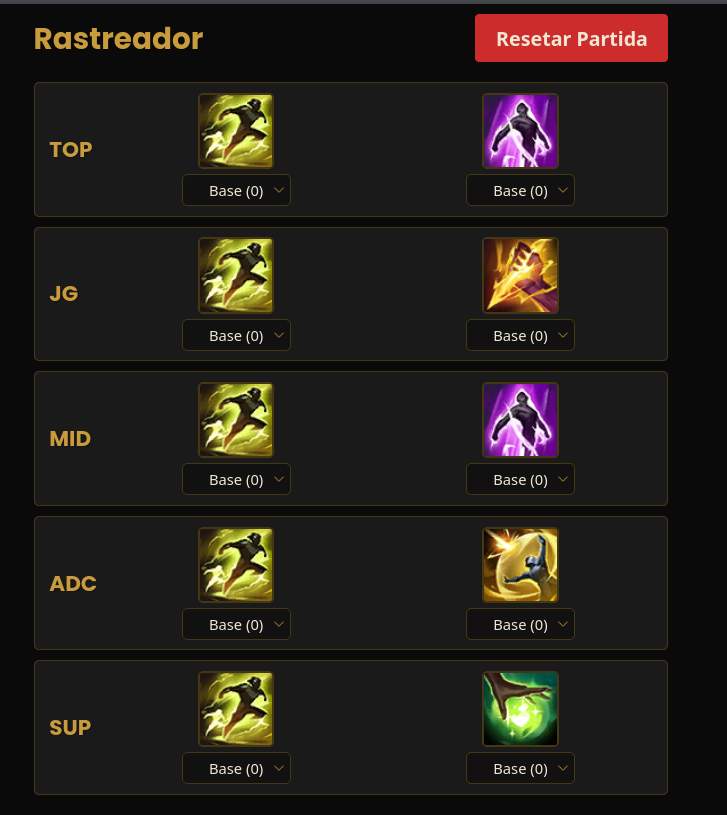

# LoL Spell Tracker

Um rastreador leve e focado para uso mobile de Feitiços de Invocador de League of Legends.

## Link da Aplicação

- https://sonda11.github.io/lol-spell-tracker/

Este projeto é uma ferramenta de página única, construída em **HTML**, **CSS** e **JavaScript** puros, projetada para ser hospedada gratuitamente no GitHub Pages e utilizada diretamente no navegador do celular durante partidas.

---

## Principais Funcionalidades

### Rastreamento por Lane
Suporte completo às cinco posições do jogo: **TOP, JG, MID, ADC e SUP**.

### Configuração Rápida
Permite selecionar rapidamente os dois Feitiços de Invocador utilizados pelo oponente em cada lane.

### Cálculo de Aceleração (Haste)
Quatro níveis de redução de recarga configuráveis por feitiço:

- **Base (0)**
- **Bota Ionianas (+10)**
- **Perspicácia Cósmica (+18)**
- **Ambos (+28)**

### Reset Individual
Cada feitiço possui um botão “✖” que permite cancelar apenas aquele timer sem reiniciar toda a partida.

### Design Mobile-First
Interface compacta e otimizada para uso com uma mão, sem necessidade de rolagem e com foco em responsividade.

---

## Como Usar

O aplicativo possui duas telas: **Setup** e **Tracker**.

### 1. Tela de Setup
- Ao abrir a aplicação, são exibidas cinco seções — uma para cada lane.
- Selecione os dois Feitiços de Invocador do oponente usando os menus dropdown.
- Após configurar, clique em **“Iniciar Tracker”**.

### 2. Tela de Tracker
- Os ícones dos feitiços configurados serão exibidos para cada lane.
- Antes de iniciar um timer, selecione o nível de Aceleração (Haste) no menu abaixo do ícone.
- Para iniciar o timer, clique no ícone do feitiço.
- Para cancelar um timer individual, clique no “✖” exibido sobre o ícone.
- Para reiniciar todos os timers e retornar ao Setup, use o botão **“Resetar Partida”**.

---

## Tecnologias Utilizadas

- HTML5  
- CSS3  
- JavaScript (Vanilla)

---

